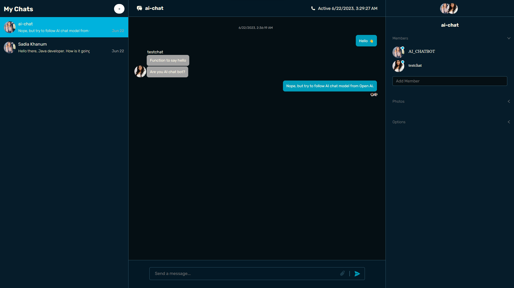

# Chat App

> Build a Chat App with NEW ChatGPT API | Full stack, React, Redux Toolkit, Node, OpenAI

# Banner Image



## Clone Repo:

```bash
git clone https://github.com/developer-hasibulislam/chat-app.git
cd chat-app
npm i
npm fund
npm audit
npm i -f
npm audit fix
npm audit fix -f
```

## Environment Setup

### Client

```
VITE_BASE_URL=
VITE_PROJECT_ID=
```

### Server

```
PORT=
PROJECT_ID=
BOT_USER_NAME=
BOT_USER_SECRET=
OPEN_API_KEY=
PRIVATE_KEY=
```

# Author

> Expert Full Stack Developer || Lead Generation Expert

- Hasibul Islam
  - `Linkedin` [hasibulislam999](https://www.linkedin.com/in/developer-hasibulislam)
  - `WhatsApp` [+8801906315901](https://wa.me/01906315901)
